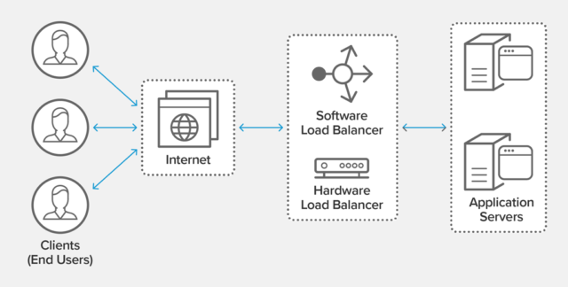

# System Design

- [Communication](#communication)
  - [UDP](#user-datagram-protocol-udp)
  - [TCP](#transmission-control-protocol-tcp)
  - [HTTP](#hypertext-transfer-protocol-http)
  - [HTTPS](#hypertext-transfer-protocol-secure-https)
- [Load Balancing](#load-balancing)
- [Reverse Proxy](#reverse-proxy)

## Communication

  
   
  <i><a href=http://www.escotal.com/osilayer.html>Source: OSI 7 layer model</a></i>

### User datagram protocol (UDP)

User Datagram Protocol (UDP) is a communications protocol that is primarily used to establish low-latency and loss-tolerating connections between applications on the internet.

UDP is connectionless.

UDP is an alternative to Transmission Control Protocol (TCP). Both UDP and TCP run on top of IP and are sometimes referred to as **UDP/IP** or **TCP/IP**.

### Transmission control protocol (TCP)

TODO

### Hypertext transfer protocol (HTTP)

HTTP is an application layer protocol built on top of **TCP** that uses a *client-server* communication model.

HTTP follows a *request‑response* paradigm in which the client makes a request and the server issues a response that includes not only the requested content, but also relevant status information about the request.

A basic HTTP request consists of a verb (method) and a resource (endpoint). Below are the common HTTP verbs:

| Verb | Description | Idempotent[1] | Safe | Cacheable |
|---|---|---|---|---|
| GET | Reads a resource | Yes | Yes | Yes |
| POST | Creates a resource or triggers a process that handles data | No | No | Yes if response contains freshness info |
| PUT | Creates or replaces a resource | Yes | No | No |
| PATCH | Partially updates a resource | No | No | Yes if response contains freshness info |
| DELETE | Deletes a resource | Yes | No | No |

> HTTP is an Application Layer protocol relying on lower-level protocols such as **TCP** and **UDP**.

#### Source(s) and further reading: HTTP

- [What is HTTP?](https://www.nginx.com/resources/glossary/http/)
- [Difference between HTTP and TCP](https://www.quora.com/What-is-the-difference-between-HTTP-protocol-and-TCP-protocol)
- [Difference between PUT and PATCH](https://laracasts.com/discuss/channels/general-discussion/whats-the-differences-between-put-and-patch?page=1)

### Hypertext Transfer Protocol Secure (HTTPS)

  
   
  <i><a href=https://support.f5.com/csp/article/K15292>Source: TLS handshake overview</a></i>

## Load Balancing

  
   
  <i><a href=https://www.nginx.com/resources/glossary/load-balancing/>Source: NGINX - What Is Load Balancing?</a></i>

**Load balancing** refers to efficiently distributing incoming network traffic across a group of backend servers, also known as a *server farm* or *server pool*.

A **load balancer** acts as the "traffic cop" sitting in front of your servers and routing client requests across all servers capable of fulfilling those requests in a manner that maximizes speed and capacity utilization and ensures that no one server is overworked, which could degrade performance.

- If a single server goes down, the load balancer redirects traffic to the remaining online servers.
- When a new server is added to the server group, the load balancer automatically starts to send requests to it.

A Load Balancer is a machine (physical or virtual), a separate instance from your application.

Usually LBs are setup in pairs so that is one LB fails, another quickly takes its place.

In general LBs are very reliable.

LBs run a software called *reverse proxy*, it's goal is to distribute the requests between multiple servers that host the actual application.

### Load Balancing Algorithms

Different load balancing algorithms provide different benefits; the choice of load balancing method depends on your needs:

- **Round Robin** – Requests are distributed across the group of servers sequentially.

- **Least Connections** – A new request is sent to the server with the fewest current connections to clients. The relative computing capacity of each server is factored into determining which one has the least connections.

- **Least Time** – Sends requests to the server selected by a formula that combines the fastest response time and fewest active connections.

- **Hash** – Distributes requests based on a key you define, such as the client IP address or the request URL.

- **IP Hash** – The IP address of the client is used to determine which server receives the request.

- **Random with Two Choices** – Picks two servers at random and sends the request to the one that is selected by then applying the Least Connections algorithm.

### Layer 4 Load Balancing

Layer 4 load balancing uses information defined at the *transport* layer (Layer 4) to decide how to distribute client requests across a group of servers.

Generally, this involves the source, destination IP addresses, and ports recorded in the packet header, **without considering the contents of the packet**.

Layer 4 load balancers forward network packets to and from the upstream server, performing [Network Address Translation (NAT)](https://www.nginx.com/resources/glossary/layer-4-load-balancing/).

### Layer 7 Load Balancing

[Layer 7 load balancing](https://www.nginx.com/resources/glossary/layer-7-load-balancing/) operates at the high‑level *application* layer, which deals with the actual content of each message.

It can make a load‑balancing decision based on the contents of the header or message (the URL or cookie, for example).

Layer 7 load balancers terminate network traffic, read the message, make a load-balancing decision, then open a connection to the selected server.
For example, a layer 7 load balancer can direct video traffic to servers that host videos while directing more sensitive user billing traffic to security-hardened servers.

Layer 7 load balancing is more CPU‑intensive than packet‑based Layer 4 load balancing, but rarely causes degraded performance on a modern server. Layer 7 load balancing enables the load balancer to make smarter load‑balancing decisions, and to apply optimizations and changes to the content (such as compression and encryption). It uses buffering to offload slow connections from the upstream servers, which improves performance.

A device that performs Layer 7 load balancing is often referred to as a [reverse‑proxy server](#reverse-proxy-server).

## Reverse Proxy Server

A **proxy server** is a *go‑between* or intermediary server that forwards requests for content from multiple clients to different servers across the Internet.

A **reverse proxy server** is a type of proxy server that typically sits behind the firewall in a private network and directs client requests to the appropriate backend server.

A reverse proxy provides an additional level of abstraction and control to ensure the smooth flow of network traffic between clients and servers.

## Reverse Proxy

TODO

[^1]: idempotent - can be called many times without different outcomes
