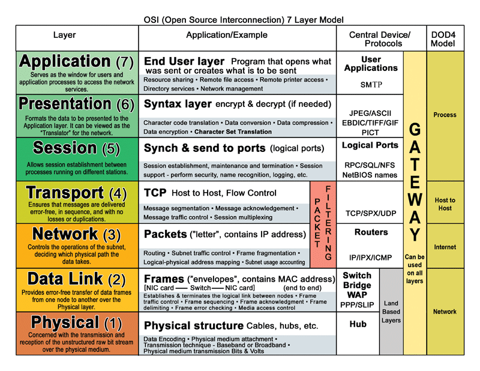

# System Design

- [Communication](#communication)
  - [HTTP](#hypertext-transfer-protocol-http)
  - [HTTPS](#hypertext-transfer-protocol-secure-https)
- [Load Balancing](#load-balancing)

## Communication

  
   
  <i><a href=http://www.escotal.com/osilayer.html>Source: OSI 7 layer model</a></i>

### Hypertext transfer protocol (HTTP)

HTTP is an application layer protocol built on top of **TCP** that uses a *client-server* communication model.
HTTP clients and servers communicate through request and response messages.

A basic HTTP request consists of a verb (method) and a resource (endpoint). Below are the common HTTP verbs:

| Verb | Description | Idempotent[1] | Safe | Cacheable |
|---|---|---|---|---|
| GET | Reads a resource | Yes | Yes | Yes |
| POST | Creates a resource or triggers a process that handles data | No | No | Yes if response contains freshness info |
| PUT | Creates or replaces a resource | Yes | No | No |
| PATCH | Partially updates a resource | No | No | Yes if response contains freshness info |
| DELETE | Deletes a resource | Yes | No | No |

> HTTP is an Application Layer protocol relying on lower-level protocols such as **TCP** and **UDP**.

#### Source(s) and further reading: HTTP

- [What is HTTP?](https://www.nginx.com/resources/glossary/http/)
- [Difference between HTTP and TCP](https://www.quora.com/What-is-the-difference-between-HTTP-protocol-and-TCP-protocol)
- [Difference between PUT and PATCH](https://laracasts.com/discuss/channels/general-discussion/whats-the-differences-between-put-and-patch?page=1)

### Hypertext Transfer Protocol Secure (HTTPS)

  
   
  <i><a href=https://support.f5.com/csp/article/K15292>Source: TLS handshake overview</a></i>

## Load Balancing

**Load balancing** refers to efficiently distributing incoming network traffic across a group of backend servers, also known as a *server farm* or *server pool*.

A **load balancer** acts as the "traffic cop" sitting in front of your servers and routing client requests across all servers capable of fulfilling those requests in a manner that maximizes speed and capacity utilization and ensures that no one server is overworked, which could degrade performance.

- If a single server goes down, the load balancer redirects traffic to the remaining online servers.
- When a new server is added to the server group, the load balancer automatically starts to send requests to it.

A Load Balancer is a machine (physical or virtual), a separate instance from your application.

Usually LBs are setup in pairs so that is one LB fails, another quickly takes its place.

In general LBs are very reliable.

LBs run a software called *reverse proxy*, it's goal is to distribute the requests between multiple servers that host the actual application.

### Load Balancing Algorithms

Different load balancing algorithms provide different benefits; the choice of load balancing method depends on your needs:

- **Round Robin** – Requests are distributed across the group of servers sequentially.

- **Least Connections** – A new request is sent to the server with the fewest current connections to clients. The relative computing capacity of each server is factored into determining which one has the least connections.

- **Least Time** – Sends requests to the server selected by a formula that combines the fastest response time and fewest active connections.

- **Hash** – Distributes requests based on a key you define, such as the client IP address or the request URL.

- **IP Hash** – The IP address of the client is used to determine which server receives the request.

- **Random with Two Choices** – Picks two servers at random and sends the request to the one that is selected by then applying the Least Connections algorithm.

[^1]: idempotent - can be called many times without different outcomes
