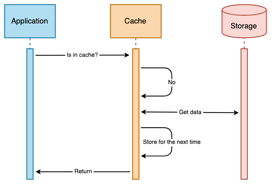
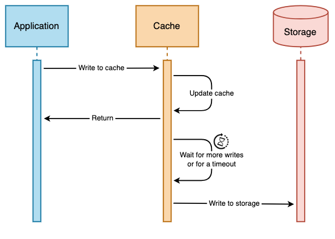

# System Design

- [Communication](#communication)
  - [UDP](#user-datagram-protocol-udp)
  - [TCP](#transmission-control-protocol-tcp)
  - [HTTP](#hypertext-transfer-protocol-http)
  - [HTTPS](#hypertext-transfer-protocol-secure-https)
- [Load Balancing](#load-balancing)
  - [Load Balancing Algorithms](#load-balancing-algorithms)
  - [Layer 4 Load Balancing](#layer-4-load-balancing)
  - [Layer 7 Load Balancing](#layer-7-load-balancing)
  - [Reverse Proxy Server](#reverse-proxy-server)
- [Reverse Proxy](#reverse-proxy)
  - [Load Balancer vs Reverse Proxy](#load-balancer-vs-reverse-proxy)
  - [Disadvantages of reverse proxy](#disadvantages-of-reverse-proxy)
- [Caching](#caching)
  - [Caching Strategies](#caching-strategies)
    - [Cache Aside](#cache-aside-lazy-loading)
    - [Read Through](#read-through)
    - [Write Through](#write-through)
    - [Write Behind](#write-behind)
  - [Eviction Policies](#eviction-policies)
    - [LRU](#lru)
    - [LFU](#lfu)

## Communication

  
   
  <i><a href=http://www.escotal.com/osilayer.html>Source: OSI 7 layer model</a></i>

### User datagram protocol (UDP)

User Datagram Protocol (UDP) is a communications protocol that is primarily used to establish low-latency and loss-tolerating connections between applications on the internet.

UDP is connectionless.

UDP is an alternative to Transmission Control Protocol (TCP). Both UDP and TCP run on top of IP and are sometimes referred to as **UDP/IP** or **TCP/IP**.

### Transmission control protocol (TCP)

TODO

### Hypertext transfer protocol (HTTP)

HTTP is an application layer protocol built on top of **TCP** that uses a *client-server* communication model.

HTTP follows a *request‑response* paradigm in which the client makes a request and the server issues a response that includes not only the requested content, but also relevant status information about the request.

A basic HTTP request consists of a verb (method) and a resource (endpoint). Below are the common HTTP verbs:

| Verb | Description | Idempotent[1] | Safe | Cacheable |
|---|---|---|---|---|
| GET | Reads a resource | Yes | Yes | Yes |
| POST | Creates a resource or triggers a process that handles data | No | No | Yes if response contains freshness info |
| PUT | Creates or replaces a resource | Yes | No | No |
| PATCH | Partially updates a resource | No | No | Yes if response contains freshness info |
| DELETE | Deletes a resource | Yes | No | No |

> HTTP is an Application Layer protocol relying on lower-level protocols such as **TCP** and **UDP**.

#### Source(s) and further reading: HTTP

- [What is HTTP?](https://www.nginx.com/resources/glossary/http/)
- [Difference between HTTP and TCP](https://www.quora.com/What-is-the-difference-between-HTTP-protocol-and-TCP-protocol)
- [Difference between PUT and PATCH](https://laracasts.com/discuss/channels/general-discussion/whats-the-differences-between-put-and-patch?page=1)

### Hypertext Transfer Protocol Secure (HTTPS)

  
   
  <i><a href=https://support.f5.com/csp/article/K15292>Source: TLS handshake overview</a></i>

## Load Balancing

  
   
  <i><a href=http://horicky.blogspot.com/2010/10/scalable-system-design-patterns.html>Source: Scalable System Design Patterns</a></i>

**Load balancing** refers to efficiently distributing incoming network traffic across a group of backend servers, also known as a *server farm* or *server pool*.

A **load balancer** acts as the "traffic cop" sitting in front of your servers and routing client requests across all servers capable of fulfilling those requests in a manner that maximizes speed and capacity utilization and ensures that no one server is overworked, which could degrade performance.

- If a single server goes down, the load balancer redirects traffic to the remaining online servers.
- When a new server is added to the server group, the load balancer automatically starts to send requests to it.

A Load Balancer is a machine (physical or virtual), a separate instance from your application.

Usually LBs are setup in pairs so that is one LB fails, another quickly takes its place.

In general LBs are very reliable.

LBs run a software called *reverse proxy*, it's goal is to distribute the requests between multiple servers that host the actual application.

### Load Balancing Algorithms

Different load balancing algorithms provide different benefits; the choice of load balancing method depends on your needs:

- **Round Robin** – Requests are distributed across the group of servers sequentially.

- **Least Connections** – A new request is sent to the server with the fewest current connections to clients. The relative computing capacity of each server is factored into determining which one has the least connections.

- **Least Time** – Sends requests to the server selected by a formula that combines the fastest response time and fewest active connections.

- **Hash** – Distributes requests based on a key you define, such as the client IP address or the request URL.

- **IP Hash** – The IP address of the client is used to determine which server receives the request.

- **Random with Two Choices** – Picks two servers at random and sends the request to the one that is selected by then applying the Least Connections algorithm.

### Layer 4 Load Balancing

Layer 4 load balancing uses information defined at the *transport* layer (Layer 4) to decide how to distribute client requests across a group of servers.

Generally, this involves the source, destination IP addresses, and ports recorded in the packet header, **without considering the contents of the packet**.

Layer 4 load balancers forward network packets to and from the upstream server, performing [Network Address Translation (NAT)](https://www.nginx.com/resources/glossary/layer-4-load-balancing/).

### Layer 7 Load Balancing

[Layer 7 load balancing](https://www.nginx.com/resources/glossary/layer-7-load-balancing/) operates at the high‑level *application* layer, which deals with the actual content of each message.

It can make a load‑balancing decision based on the contents of the header or message (the URL or cookie, for example).

Layer 7 load balancers terminate network traffic, read the message, make a load-balancing decision, then open a connection to the selected server.
For example, a layer 7 load balancer can direct video traffic to servers that host videos while directing more sensitive user billing traffic to security-hardened servers.

Layer 7 load balancing is more CPU‑intensive than packet‑based Layer 4 load balancing, but rarely causes degraded performance on a modern server. Layer 7 load balancing enables the load balancer to make smarter load‑balancing decisions, and to apply optimizations and changes to the content (such as compression and encryption). It uses buffering to offload slow connections from the upstream servers, which improves performance.

A device that performs Layer 7 load balancing is often referred to as a [reverse‑proxy server](#reverse-proxy-server).

## Reverse Proxy Server

A **proxy server** is a *go‑between* or intermediary server that forwards requests for content from multiple clients to different servers across the Internet.

A **reverse proxy server** is a type of proxy server that typically sits behind the firewall in a private network and directs client requests to the appropriate backend server.

A reverse proxy provides an additional level of abstraction and control to ensure the smooth flow of network traffic between clients and servers.

Common uses for a reverse proxy server include:

- **Load balancing**
- **Web acceleration** – Reverse proxies can compress inbound and outbound data, as well as cache commonly requested content, both of which speed up the flow of traffic between clients and servers. They can also perform additional tasks such as SSL encryption to take load off of your web servers, thereby boosting their performance.
- **Security and anonymity** – By intercepting requests headed for your backend servers, a reverse proxy server protects their identities and acts as an additional defense against security attacks. It also ensures that multiple servers can be accessed from a single record locator or URL regardless of the structure of your local area network.

## Reverse Proxy

You can think of the reverse proxy as a website's "public face". Its address is the one advertised for the website, and it sits at the edge of the site's network to accept requests from web browsers and mobile apps for the content hosted at the website.

benefits:

- **Increased security** - Hide information about backend servers, blacklist IPs, limit number of connections per client
- **Increased scalability and flexibility** - Because clients see only the reverse proxy’s IP address, you are free to change the configuration of your backend infrastructure.
- **Compression** - Compress server responses before returning them to the client
- **SSL termination** - Decrypt incoming requests and encrypt server responses so backend servers do not have to perform these potentially expensive operations
  - Removes the need to install X.509 certificates on each server
- **Caching** - Before returning the backend server’s response to the client, the reverse proxy stores a copy of it locally.

### Load Balancer vs Reverse Proxy

- Deploying a load balancer is useful when you have multiple servers. Often, load balancers route traffic to a set of servers serving the same function.
- Reverse proxies can be useful even with just one web server or application server, opening up the benefits described in the previous section.
- Solutions such as NGINX and HAProxy can support both layer 7 reverse proxying and load balancing.

### Disadvantages of reverse proxy

- Introducing a reverse proxy results in increased complexity.
- A single reverse proxy is a single point of failure, configuring multiple reverse proxies further increases complexity.

## Caching

  
   
  <i><a href=http://horicky.blogspot.com/2010/10/scalable-system-design-patterns.html>Source: Scalable System Design Patterns</a></i>

**Pros:**
- Improve read performance (_latency_)
- Reduce the load (_throughput_)

**Cons:**
- Increases complexity and might introduce inconsistency
- Consumes resources

### Caching Strategies

- Cache Aside
- Read Through
- Write Through
- Write Behind

#### Cache Aside (Lazy Loading)

  

- With this strategy, the application has access to both the cache and the storage.
- When your application needs to read data from the database, it checks the cache first to determine whether the data is available.
- If the data is available (_a cache hit_), the cached data is returned, and the response is issued to the caller.
- If the data isn't available (_a cache miss_), the database is queried for the data.
  The cache is then populated with the data that is retrieved from the database, and the data is returned to the caller.
- This is a common pattern if you are using an external cache like Redis.

**Pros:**
- The cache contains only data that the application actually requests, which helps keep the cache size cost-effective.
- Implementing this approach is straightforward and produces immediate performance gains.

**Cons:**
- Cache misses are expensive (retrieve the data from the storage and update the cache).
- Data is loaded into the cache only after a cache miss.
- Some overhead is added to the initial response time because additional round trips to the cache and database are needed.

#### Read Through

  

- In this strategy, the application does not have direct access to the storage, it always interacts with the cache API.
- In case of cache miss, the cache API will fetch the results from the storage, update them in cache and the return them to the application.
- This pattern is quite common in ORM frameworks and the data is usually stored in the memory.

**Pros:**
- Cache only the data that is needed (if the key is not accessed then we will not cache it)
- Transparent (as a developer you are not even aware that there is a cache, you work with a single API)

**Cons:**
- Cache misses are expensive (retrieve the data from the storage and update the cache)
- Data staleness
- Reliability

#### Write Through

  

- A write-through cache reverses the order of how the cache is populated.
- Instead of lazy-loading the data in the cache after a cache miss, the cache is proactively updated immediately after the storage update.
- The application interacts with the cache API that for each update also stores data in cache.
- The benefit of this approach is the data in the cache is never stale.

**Pros:**
- Because the cache is up-to-date with the storage, there is a much greater likelihood that the data will be found in the cache.
  This, in turn, results in better overall application performance and user experience.
- The performance of your database is optimal because fewer database reads are performed.

**Cons:**
- Writes are expensive - introduces extra write **latency** because data is written to the cache first and then to the storage (two write operations).
- Infrequently-requested data is also written to the cache, resulting in a larger and more expensive cache.

#### Write Behind

  

- Very similar to Write Through.
- The only difference is the data is not written to the storage immediately.
- Instead, the cache will wait for more events/timeout and only then flush everything to storage.
- So, in this case the cache acts like a buffer.

**Pros:**
- No write penalty (writes seem very fast because we don't write to the slow(er) storage everytime)
- Reduced load on storage

**Cons:**
- Reliability (if the cache crashes then we will lose some updates)
- Lack of consistency (if we don't flush the data from cache to storage often enough then it may create inconsistencies in the data)

### Eviction Policies

- LRU - Least Recently Used
- LFU - Least Frequently Used
- ...

#### LRU

#### LFU

[^1]: idempotent - can be called many times without different outcomes
